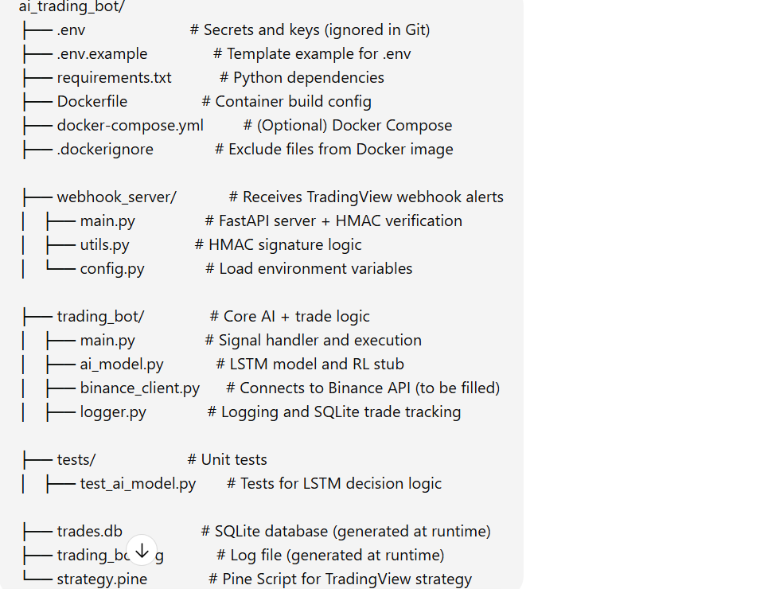
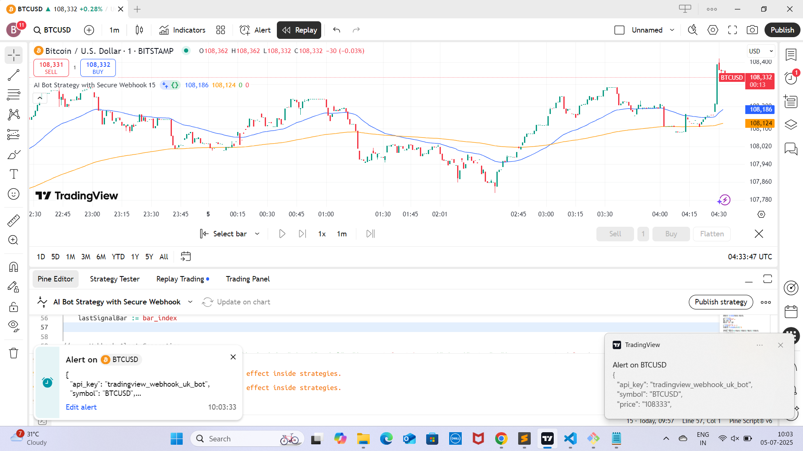
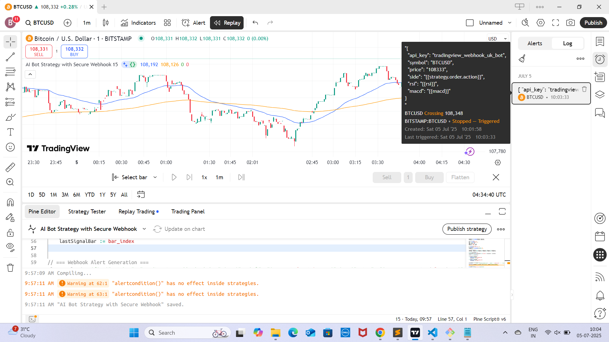
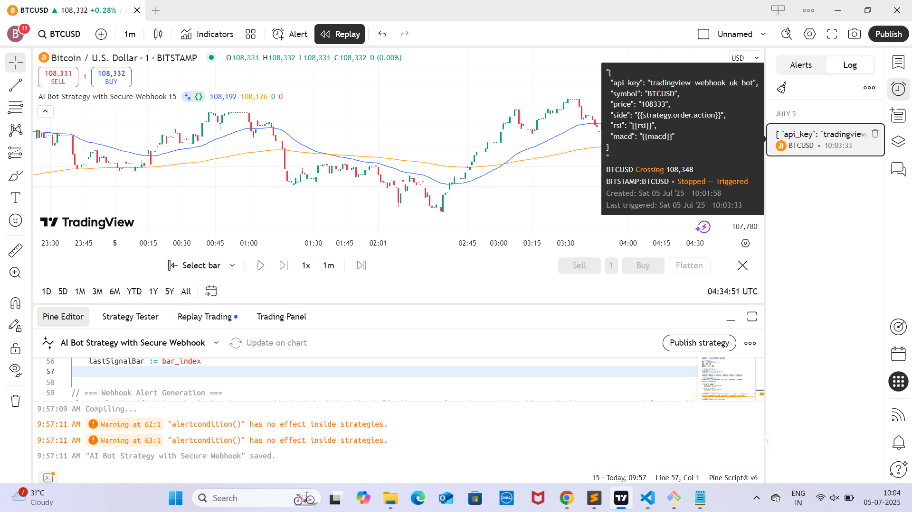
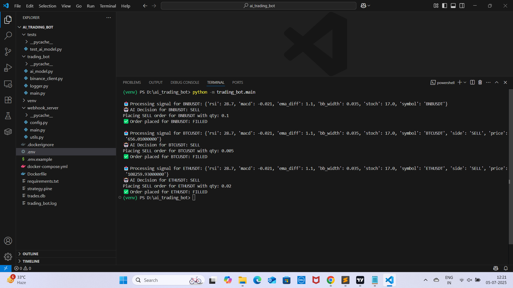
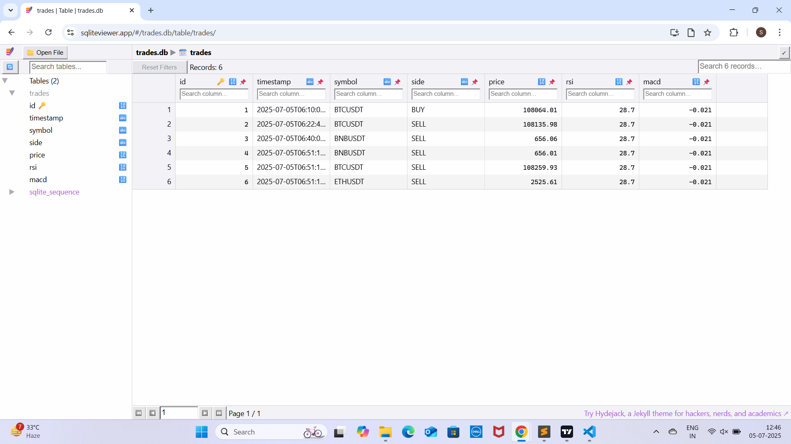
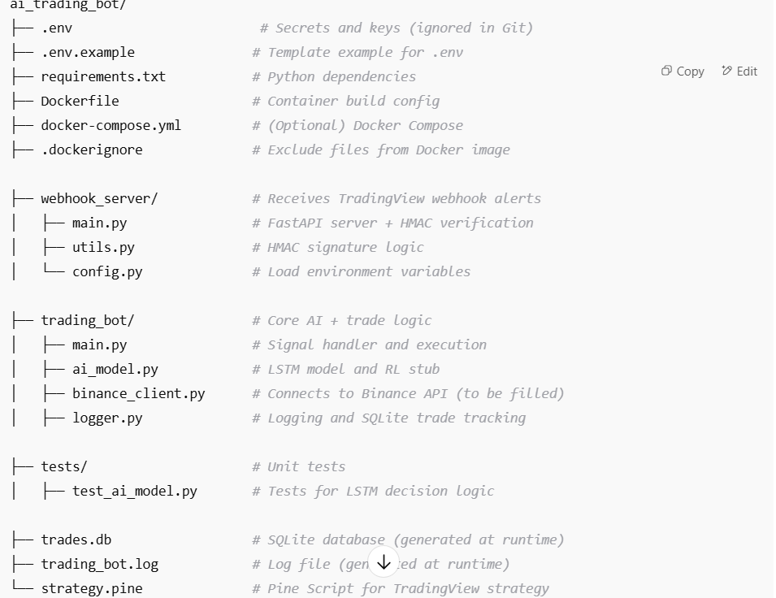
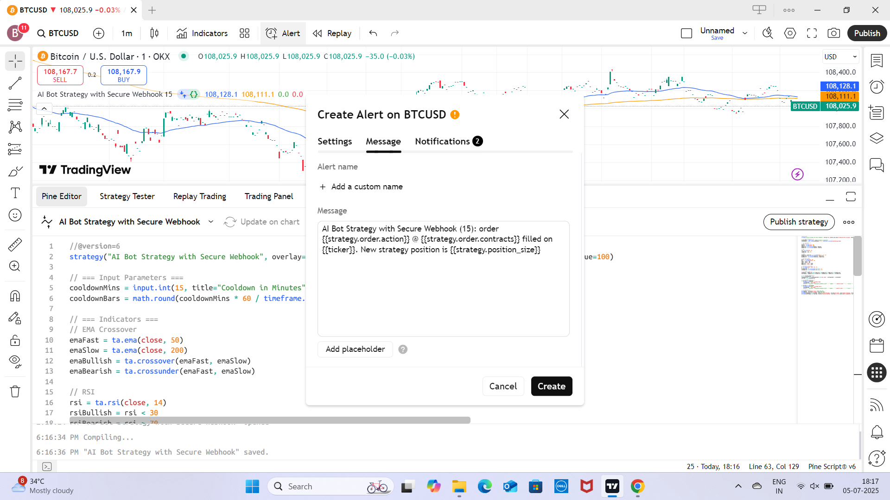
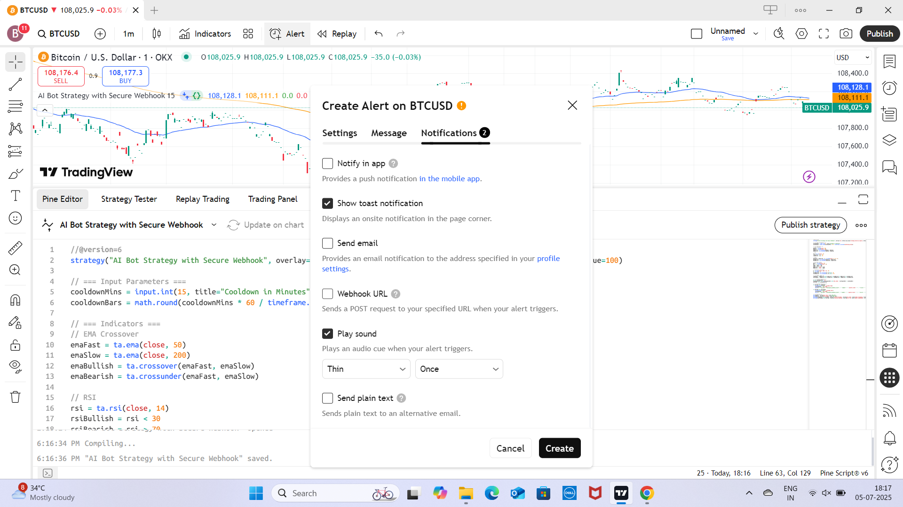

# 🤖 AI-Powered Trading Bot System

An intelligent crypto trading bot built with Python, Binance Testnet, TradingView Webhooks, and FastAPI. Uses AI signals like RSI, MACD, EMA crossovers, and more to make automated buy/sell decisions.

---

## 📁 Project Structure



---

## 📸 Screenshots

| 📈 TradingView              | ⚙️ Webhook Server         | ✅ Trade Log              |
|----------------------------|---------------------------|---------------------------|
|  |  |  |
|  |  |  |
|  |  |

---

## 🔐 API Keys & Setup

### 🔑 1. TradingView Webhook API Key

Generate from [uuidgenerator.net](https://www.uuidgenerator.net)

```env
API_KEY=tradingview_webhook_uk_bot  #create your own key 
SECRET_KEY=d4f0c532-3905-449f-b7da-69ee07125da7  # generate from uuidgenerator.net

🔑 2. Binance Testnet Keys
Create from https://testnet.binance.vision


BINANCE_API_KEY=your_testnet_api_key   
BINANCE_API_SECRET=your_testnet_api_secret   
USE_TESTNET=true

⚙️ Example .env File


API_KEY=tradingview_webhook_uk_bot  #create your own key 
SECRET_KEY=d4f0c532-3905-449f-b7da-69ee07125da7    # generate from uuidgenerator.net

#Create from https://testnet.binance.vision

BINANCE_API_KEY=your_testnet_api_key
BINANCE_API_SECRET=your_testnet_api_secret
USE_TESTNET=true

SYMBOLS=BNBUSDT,BTCUSDT,ETHUSDT

MAX_POSITION_SIZE=0.01
COOLDOWN_SECONDS=60

MAX_POSITION_SIZE_BNB=0.1
MAX_POSITION_SIZE_ETH=0.02
MAX_POSITION_SIZE_BTC=0.005

🧪 Run Locally (Virtual Environment)

1️⃣ Clone the Repo


git clone https://github.com/SarabpreetBedi/AI-Powered-Trading-Bot-System.git
cd AI-Powered-Trading-Bot-System

2️⃣ Setup Virtual Environment


python -m venv venv
Activate (choose your OS):


venv\Scripts\activate


source venv/bin/activate
3️⃣ Install Dependencies


pip install -r requirements.txt

4️⃣ Create .env File


cp .env.example .env
Edit .env with your API keys.

5️⃣ Start Webhook Server


uvicorn webhook_server.main:app --reload --port 8000

6️⃣ Test Signal Manually


python -m trading_bot.main

🐳 Run via Docker

1️⃣ Build and Start


docker-compose up --build

2️⃣ Access API Docs
Visit:


http://localhost:8000/docs

3️⃣ Test Webhook Manually


curl -X POST http://localhost:8000/webhook \
  -H "Content-Type: application/json" \
  -d '{"symbol": "BTCUSDT", "rsi": 30, "macd": -0.1, "side": "buy"}'


📡 Connect to TradingView
✅ Example Pine Script Alert Payload
pinescript

alert('{' +
  '"api_key": "tradingview_webhook_uk_bot",' +  #create and use your own key
  '"symbol": "' + syminfo.ticker + '",' +
  '"price": "' + str.tostring(close) + '",' +
  '"side": "buy",' +
  '"rsi": "' + str.tostring(rsi) + '",' +
  '"macd": "' + str.tostring(macdLine) + '"' +
'}', freq=alert.freq_once_per_bar)


🔗 Webhook URL
text

http://<your-server-ip>:8000/webhook
Ensure port 8000 is open if you're using a cloud VPS.

✅ Features
🤖 AI-based decision making (RSI, MACD, EMA crossover)

🧠 LSTM & rule-based logic

🔄 Symbol-specific trade sizing

⏳ Cooldown management per symbol

🧾 Trade logging to SQLite

⚡ FastAPI webhook endpoint

🐳 Docker & virtual environment support

🧪 Run Unit Tests


pytest tests/

⚠️ Disclaimer
This bot operates on Binance Testnet only.


📝 License
MIT License

👨‍💻 Author
Sarabpreet Bedi
